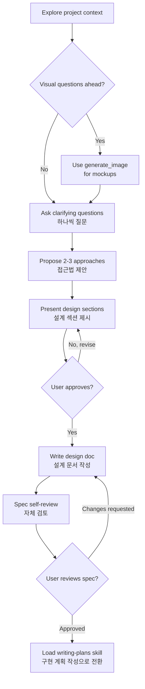

# Brainstorming Ideas Into Designs
# (아이디어를 설계로 전환하기)

Help turn ideas into fully formed designs and specs through natural collaborative dialogue.
<!-- 자연스러운 대화를 통해 아이디어를 완전한 설계와 명세로 발전시킵니다. -->

Start by understanding the current project context, then ask questions one at a time to refine the idea. Once you understand what you're building, present the design and get user approval.

<HARD-GATE>
<!-- 🚨 절대 규칙: 설계 제시 & 사용자 승인 전에는 코드 작성, 프로젝트 스캐폴딩 등 어떤 구현 행위도 금지 -->
Do NOT write any code, scaffold any project, or take any implementation action until you have presented a design and the user has approved it. This applies to EVERY project regardless of perceived simplicity.
</HARD-GATE>

## Anti-Pattern: "This Is Too Simple To Need A Design"
<!-- 안티패턴: "이건 너무 단순해서 설계가 필요 없어" — 단순한 프로젝트일수록 검증되지 않은 가정이 가장 많은 낭비를 만듭니다 -->

Every project goes through this process. A todo list, a single-function utility, a config change — all of them. "Simple" projects are where unexamined assumptions cause the most wasted work. The design can be short (a few sentences for truly simple projects), but you MUST present it and get approval.

## Checklist
<!-- 반드시 아래 순서대로 각 항목을 완료할 것 -->

You MUST complete these items in order:

1. **Explore project context** — check files, docs, recent commits
   <!-- 프로젝트 컨텍스트 파악: 파일, 문서, 최근 커밋 확인 -->
2. **Ask clarifying questions** — one at a time, understand purpose/constraints/success criteria
   <!-- 명확화 질문: 한 번에 하나씩, 목적/제약/성공 기준 파악 -->
3. **Propose 2-3 approaches** — with trade-offs and your recommendation
   <!-- 2-3가지 접근법 제안: 장단점 + 추천안 -->
4. **Present design** — in sections scaled to their complexity, get user approval after each section
   <!-- 설계 제시: 복잡도에 맞게 섹션별 제시, 각 섹션마다 사용자 승인 -->
5. **Write design doc** — save to project docs directory and commit
   <!-- 설계 문서 작성: 프로젝트 docs/ 디렉토리에 저장 -->
6. **Spec self-review** — quick inline check for placeholders, contradictions, ambiguity, scope
   <!-- 명세 자체 검토: 플레이스홀더, 모순, 모호함, 범위 점검 -->
7. **User reviews written spec** — ask user to review the spec file before proceeding
   <!-- 사용자 검토: 진행 전 사용자에게 명세 파일 검토 요청 -->
8. **Transition to implementation** — load `writing-plans` skill to create implementation plan
   <!-- 구현 전환: writing-plans 스킬을 로드하여 구현 계획 작성 -->

## Process Flow

**The terminal state is loading writing-plans.** Do NOT proceed to implementation code. The ONLY next step after brainstorming is writing-plans.

## The Process

**Understanding the idea:**

- Check out the current project state first (files, docs, recent commits)
- Before asking detailed questions, assess scope: if the request describes multiple independent subsystems, flag this immediately. Don't spend questions refining details of a project that needs to be decomposed first.
- If the project is too large for a single spec, help the user decompose into sub-projects. Each sub-project gets its own spec → plan → implementation cycle.
- For appropriately-scoped projects, ask questions one at a time to refine the idea
- Prefer multiple choice questions when possible, but open-ended is fine too
- Only one question per message
- Focus on understanding: purpose, constraints, success criteria

**Exploring approaches:**

- Propose 2-3 different approaches with trade-offs
- Present options conversationally with your recommendation and reasoning
- Lead with your recommended option and explain why

**Presenting the design:**

- Once you believe you understand what you're building, present the design
- Scale each section to its complexity: a few sentences if straightforward, up to 200-300 words if nuanced
- Ask after each section whether it looks right so far
- Cover: architecture, components, data flow, error handling, testing
- Be ready to go back and clarify if something doesn't make sense

**Design for isolation and clarity:**

- Break the system into smaller units that each have one clear purpose
- Each unit: what does it do, how do you use it, what does it depend on?
- Smaller, well-bounded units are easier to work with — better reasoning, more reliable edits

**Working in existing codebases:**
<!-- 기존 코드베이스 작업 시 -->

- Explore the current structure before proposing changes. Follow existing patterns.
- Where existing code has problems that affect the work, include targeted improvements as part of the design
- Don't propose unrelated refactoring. Stay focused on what serves the current goal.

## After the Design

**Documentation:**

- Write the validated design (spec) to `docs/specs/YYYY-MM-DD-<topic>-design.md`
  - (User preferences for spec location override this default)
  <!-- 사용자가 지정한 위치가 우선 -->

**Spec Self-Review:**
<!-- 명세 작성 후 fresh eyes로 검토 -->
After writing the spec document, look at it with fresh eyes:

1. **Placeholder scan:** Any "TBD", "TODO", incomplete sections, or vague requirements? Fix them.
2. **Internal consistency:** Do any sections contradict each other?
3. **Scope check:** Is this focused enough for a single implementation plan?
4. **Ambiguity check:** Could any requirement be interpreted two different ways?

Fix any issues inline. No need to re-review — just fix and move on.

**User Review Gate:**
After the spec review loop passes, ask the user to review the written spec before proceeding:

> "Spec written and committed to `<path>`. Please review it and let me know if you want to make any changes before we start writing out the implementation plan."
> <!-- "명세가 `<경로>`에 작성/커밋되었습니다. 구현 계획 작성 전에 변경하실 사항이 있으시면 알려주세요." -->

Wait for the user's response. Only proceed once the user approves.

**Implementation:**

- Load `.agent/skills/writing-plans/SKILL.md` via `view_file` to create a detailed implementation plan
- Do NOT proceed to any other step. writing-plans is the next step.

## Key Principles

- **One question at a time** — Don't overwhelm with multiple questions
  <!-- 한 번에 하나씩 질문 -->
- **Multiple choice preferred** — Easier to answer when possible
  <!-- 가능하면 선다형 -->
- **YAGNI ruthlessly** — Remove unnecessary features from all designs
  <!-- 불필요한 기능은 철저히 제거 -->
- **Explore alternatives** — Always propose 2-3 approaches before settling
  <!-- 항상 2-3가지 대안 탐색 -->
- **Incremental validation** — Present design, get approval before moving on
  <!-- 점진적 검증: 승인 후 다음 단계 -->
- **Be flexible** — Go back and clarify when something doesn't make sense
  <!-- 유연하게: 불명확하면 돌아가서 확인 -->

## Visual Aid (Antigravity)
<!-- Antigravity에서는 generate_image 도구로 목업/다이어그램 생성 가능 -->

When visual questions arise (mockups, layouts, architecture diagrams), use the `generate_image` tool to create visual aids. Decide per-question whether visual or text is more effective:
- **Use generate_image** for: mockups, wireframes, layout comparisons, architecture diagrams
- **Use text** for: requirements questions, conceptual choices, tradeoff lists, scope decisions
