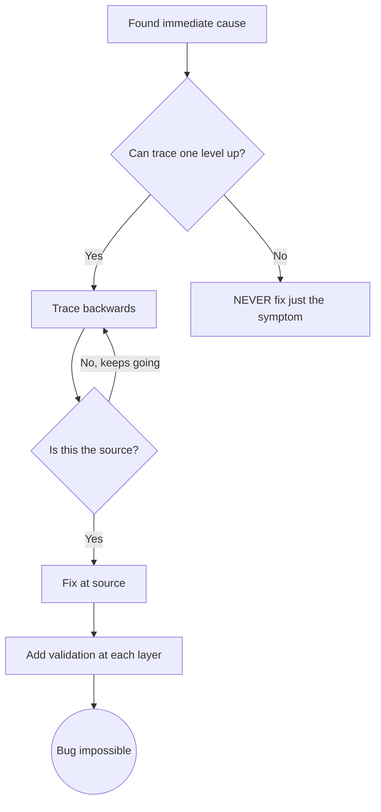

# Root Cause Tracing
# (근본 원인 역추적)

## Overview

Bugs often manifest deep in the call stack. Your instinct is to fix where the error appears, but that's treating a symptom.
<!-- 버그는 콜 스택 깊은 곳에서 나타나는 경우가 많습니다. 에러가 보이는 곳에서 고치려는 것은 증상 치료입니다. -->

**Core principle:** Trace backward through the call chain until you find the original trigger, then fix at the source.
<!-- 핵심: 콜 체인을 역추적하여 최초 트리거를 찾고, 원천에서 수정합니다. -->

## When to Use

- Error happens deep in execution (not at entry point)
- Stack trace shows long call chain
- Unclear where invalid data originated
- Need to find which test/code triggers the problem

## The Tracing Process

### 1. Observe the Symptom
```
Error: git init failed in /Users/project/packages/core
```

### 2. Find Immediate Cause
**What code directly causes this?**
```typescript
await execFileAsync('git', ['init'], { cwd: projectDir });
```

### 3. Ask: What Called This?
```
WorktreeManager.createSessionWorktree(projectDir, sessionId)
  → called by Session.initializeWorkspace()
  → called by Session.create()
  → called by test at Project.create()
```

### 4. Keep Tracing Up
**What value was passed?**
- `projectDir = ''` (empty string!)
- Empty string as `cwd` resolves to `process.cwd()`
- That's the source code directory!

### 5. Find Original Trigger
**Where did empty string come from?**
```typescript
const context = setupCoreTest(); // Returns { tempDir: '' }
Project.create('name', context.tempDir); // Accessed before beforeEach!
```

## Adding Stack Traces
<!-- 수동 추적이 어려울 때 계측 코드 추가 -->

When you can't trace manually, add instrumentation:

```typescript
// Before the problematic operation
async function gitInit(directory: string) {
  const stack = new Error().stack;
  console.error('DEBUG git init:', {
    directory,
    cwd: process.cwd(),
    stack,
  });
  await execFileAsync('git', ['init'], { cwd: directory });
}
```

**In Antigravity:** Use `run_command` to execute and capture debug output.

## Key Principle



**NEVER fix just where the error appears.** Trace back to find the original trigger.

## Stack Trace Tips

- **In tests:** Use `console.error()` not logger — logger may be suppressed
- **Before operation:** Log before the dangerous operation, not after it fails
- **Include context:** Directory, cwd, environment variables, timestamps
- **Capture stack:** `new Error().stack` shows complete call chain
