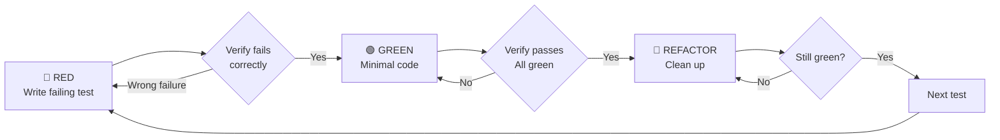

# Test-Driven Development (TDD)
# (테스트 주도 개발)

## Overview

Write the test first. Watch it fail. Write minimal code to pass.
<!-- 테스트를 먼저 작성합니다. 실패를 확인합니다. 통과할 최소한의 코드를 작성합니다. -->

**Core principle:** If you didn't watch the test fail, you don't know if it tests the right thing.
<!-- 핵심: 테스트 실패를 확인하지 않았다면, 올바른 것을 테스트하는지 알 수 없습니다. -->

## When to Use

**Always:**
- New features / 새 기능
- Bug fixes / 버그 수정
- Refactoring / 리팩토링
- Behavior changes / 동작 변경

**Exceptions (ask user):**
- Throwaway prototypes / 일회성 프로토타입
- Generated code / 생성된 코드
- Configuration files / 설정 파일

## The Iron Law

```
NO PRODUCTION CODE WITHOUT A FAILING TEST FIRST
(실패하는 테스트 없이 프로덕션 코드 작성 금지)
```

Write code before the test? Delete it. Start over. No exceptions.

## Red-Green-Refactor



### RED — Write Failing Test
<!-- 🔴 실패하는 테스트 작성 -->

Write one minimal test showing what should happen.

**Requirements:**
- One behavior
- Clear name describing the behavior
- Real code (no mocks unless unavoidable)

### Verify RED — Watch It Fail
<!-- 실패 확인: 반드시 run_command로 실행하여 확인 -->

**MANDATORY. Never skip.** Run via `run_command`:

```bash
npm test path/to/test.test.ts
# or: pytest tests/path/test.py::test_name -v
```

Confirm:
- Test fails (not errors)
- Failure message is expected
- Fails because feature missing (not typos)

### GREEN — Minimal Code
<!-- 🟢 최소한의 코드로 테스트 통과 -->

Write simplest code to pass the test. Don't add features, refactor other code, or "improve" beyond the test.

### Verify GREEN — Watch It Pass
<!-- 통과 확인: 반드시 run_command로 실행하여 확인 -->

**MANDATORY.** Run via `run_command`:

```bash
npm test path/to/test.test.ts
```

Confirm: Test passes, other tests still pass, output pristine.

### REFACTOR — Clean Up
<!-- 🔵 리팩토링: GREEN 상태에서만 -->

After green only: Remove duplication, improve names, extract helpers.
Keep tests green. Don't add behavior.

## Good Tests

| Quality | Good | Bad |
|---------|------|-----|
| **Minimal** | One thing. "and" in name? Split it. | `test('validates email and domain and whitespace')` |
| **Clear** | Name describes behavior | `test('test1')` |
| **Shows intent** | Demonstrates desired API | Obscures what code should do |

## Why Order Matters

- **"I'll write tests after to verify"** → Tests passing immediately prove nothing. You never saw it catch the bug.
- **"Already manually tested"** → No record, can't re-run, easy to forget cases.
- **"Deleting X hours of work is wasteful"** → Sunk cost fallacy. Keeping unverified code is technical debt.
- **"TDD is dogmatic"** → TDD IS pragmatic: finds bugs before commit, prevents regressions, documents behavior.

## Common Rationalizations

| Excuse | Reality |
|--------|---------|
| "Too simple to test" | Simple code breaks. Test takes 30 seconds. |
| "I'll test after" | Tests passing immediately prove nothing. |
| "Need to explore first" | Fine. Throw away exploration, start with TDD. |
| "Test hard = design unclear" | Hard to test = hard to use. Simplify. |
| "TDD will slow me down" | TDD faster than debugging. |
| "Existing code has no tests" | You're improving it. Add tests for existing code. |

## Red Flags — STOP and Start Over
<!-- 🚨 아래 상황이면 멈추고 다시 시작 -->

- Code before test
- Test passes immediately
- Can't explain why test failed
- Rationalizing "just this once"
- "Keep as reference" or "adapt existing code"

**All of these mean: Delete code. Start over with TDD.**

## Verification Checklist
<!-- 완료 전 점검 목록 -->

Before marking work complete:

- [ ] Every new function/method has a test
- [ ] Watched each test fail before implementing
- [ ] Each test failed for expected reason
- [ ] Wrote minimal code to pass each test
- [ ] All tests pass (verified via `run_command`)
- [ ] Output pristine (no errors, warnings)
- [ ] Tests use real code (mocks only if unavoidable)
- [ ] Edge cases and errors covered

## When Stuck

| Problem | Solution |
|---------|----------|
| Don't know how to test | Write wished-for API. Write assertion first. Ask user. |
| Test too complicated | Design too complicated. Simplify interface. |
| Must mock everything | Code too coupled. Use dependency injection. |
| Test setup huge | Extract helpers. Still complex? Simplify design. |

## Testing Anti-Patterns
<!-- 테스트 안티패턴: 이것들을 피할 것 -->

When adding mocks or test utilities, avoid these common pitfalls:
- **Testing mock behavior instead of real behavior** — Mocks should simulate dependencies, not become the test subject
- **Adding test-only methods to production classes** — Tests should use the public API
- **Mocking without understanding dependencies** — Know what you're replacing and why

## Final Rule

```
Production code → test exists and failed first
Otherwise → not TDD
(프로덕션 코드 → 테스트가 존재하고 먼저 실패했어야 함)
```

No exceptions without user's explicit permission.
